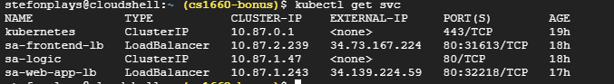
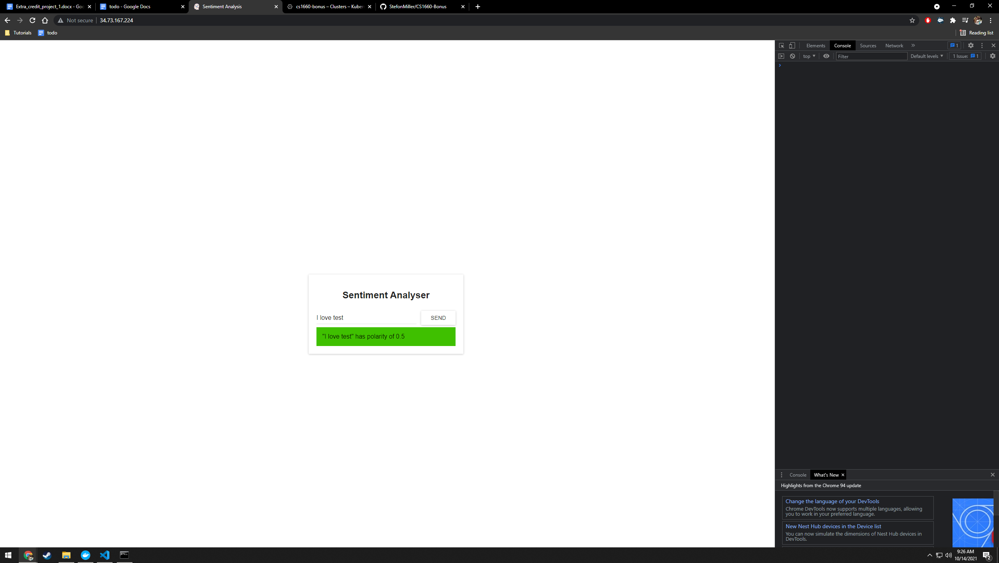

# CS1660-Bonus

## Container URLs
1. [sentiment-analysis-frontend](https://hub.docker.com/repository/docker/smm248/sentiment-analysis-frontend)

2. [sentiment-analysis-webapp](https://hub.docker.com/repository/docker/smm248/sentiment-analysis-webapp)

3. [sentiment-analysis-logic](https://hub.docker.com/repository/docker/smm248/sentiment-analysis-logic)

## Screenshots
1. Screenshot of Kubernetes service IP addresses on GCP:

2. Screenshot of sentiment analysis frontend running on Kubernetes service IP:
 
 
 ## Reproduction steps
 Below are the steps to get my containers running on GCP:
 1. 
